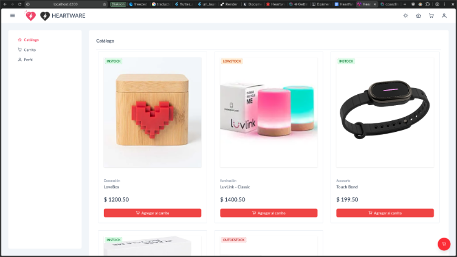
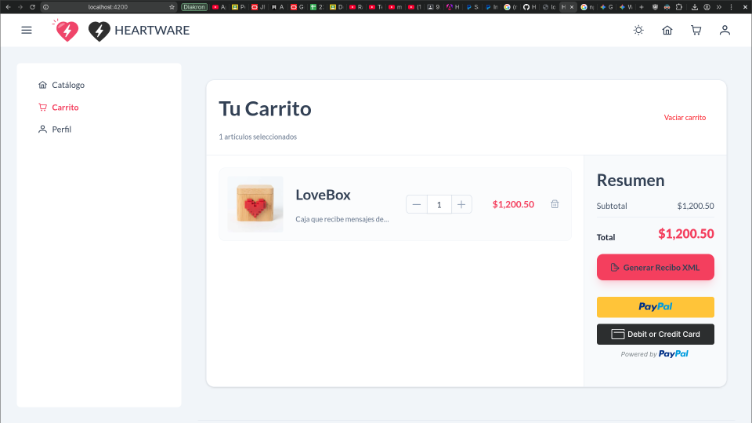
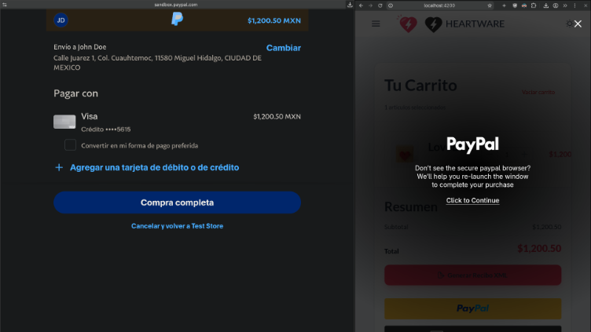
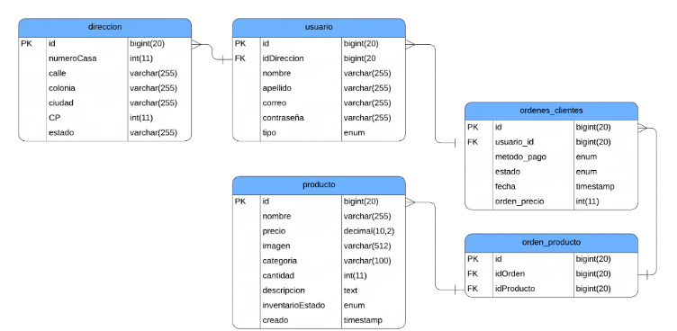
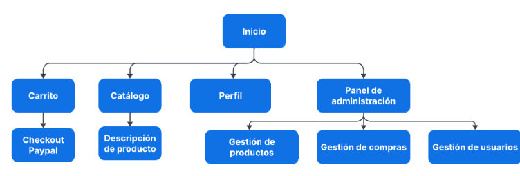

# HEARTWARE


A modern full-stack e-commerce web platform built with Angular 21, PrimeNG, Node.js, Express, and MySQL, featuring integrated PayPal checkout and CFDI 4.0 XML invoicing.

## Features

- Product Management (CRUD): Complete administration panel for creating, updating, listing, and deleting products with automated image upload support.
- Shopping Cart & Checkout: Responsive, interactive cart management powered by PrimeNG components.
- PayPal Integration: Payment processing via PayPal API.
- CFDI 4.0 Tax Invoicing: Automatic invoice and ticket export in XML format complying with CFDI 4.0 standards.
- User & Role Management: Portal designed for multiple user profiles (Admin, Store, Collection Center, Collector, Participant).

## Demo Screenshots

### Product catalog


### Shopping cart


### Payment via PayPal



## Architecture & Diagrams

Entity-Relationship Diagram



Navigation tree



## Repository Structure
```text
Heartware
├── backend (Node.js server)
│   ├── public (assets)
│   └── src (source code)
├── docs 
├── sql 
│   └── heartware.sql (SQL database scheme)
├── src (frontend source code)
└── public (frontend assets)
    ├── admin
    ├── collection-center
    ├── collector
    ├── participant
    └── store
```

## Getting started

### Prerequisites

Ensure you have the following software installed:
  - Node.js: v18.x or v20.x higher
  - npm: v9.x or higher
  - Angular CLI: v21.x (npm install -g @angular/cli)
  - MySQL / LAMPP / XAMPP: For local database hosting

### Installation

1. Clone the repository

```bash
git clone https://github.com/Adotal/Heartware.git
cd Heartware
```

2. Install frontend dependencies

```bash
npm install
```

3. Install backend dependencies

```bash
cd backend
npm install
cd ..
```

### Database & Envrionment setup

1. Database import
   
 - Start your MySQL server (via XAMPP/LAMPP or standalone).
 - Create a database (heartware).
 - Import the database schema from sql/heartware.sql:

```bash
mysql -u root -p heartware < sql/heartware.sql
```

2. Create a .env file inside the backend/ directory based on .env.example


## Running application

### Option A: Automated script

Use the provided shell script to start the backend and frontend simultaneously:

```bash
./init.sh
```


### Option B: Manual setup

1. Start the Express API Server:

```bash
cd backend
npm start
```

2. Start the Angular Frontend:

```bash
ng serve
```

### Application on localhost 

Once the server is running, open your browser and navigate to `http://localhost:4200/`. The application will automatically reload whenever you modify any of the source files.

## sakai-ng

This e-commerce webapp is based on sakai-ng open template & components, for someone interested in use this template the steps to install it are:

1. Clone sakai-ng
```bash
git clone https://github.com/primefaces/sakai-ng.git
```
2. Go to assets in sakai and clone subrepository
```bash
cd src/assets/
git clone https://github.com/cetincakiroglu/sakai-assets.git
cd ..
```
3. Install dependencies
```bash
npm install
```

## Developers

| Name                       | Description                    |
| :------------------------- | :----------------------------- |
| Adro Yael Ornelas Ornelas  | https://github.com/Adotal      |
| Adrián Kosey Angeles Ramos | https://github.com/AdrianKosey |